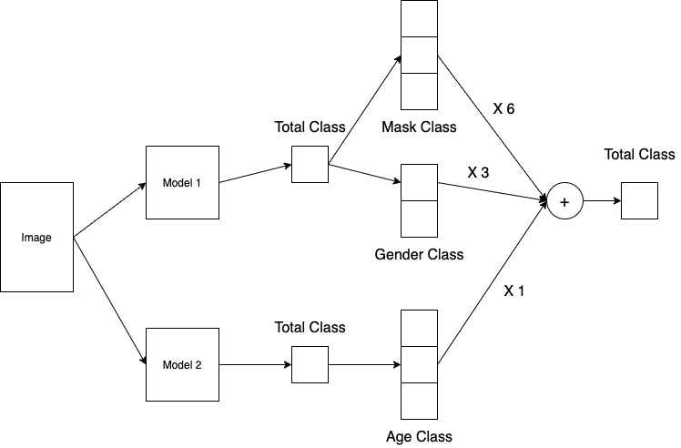

# RecSys 12걸지말조

<details>
    <summary>협업 규칙</summary>
    <div markdown="1">
        
# 코딩 컨벤션
- [Python black](https://velog.io/@gyuseok-dev/Python.-Black-the-Code-Formatter)
    - 커밋시에는 무조건 black 해서 올리기
- 변수명 통일
    - learning rate : "lr"

- 모듈 명은 짧은 소문자로
- 클래스 명은 카멜케이스(CamelCase)로 작성
- 함수명은 소문자로
- 인스턴스 메소드의 첫 번째 인수는 항상 self    
- 클래스 메소드의 첫 번째 인수는 항상 cls
- 상수(Constant)는 모듈 단위에서만 정의, 모두 대문자 등등

# Git 협업 룰
## 커밋 메시지 작성 규칙 
- [카테고리] - [수정내용]
- 카테고리
    - add
    - fix
    - mod
    - rm
        
</div>
</details>

# Image Classification - Mask Classification

<details>
    <summary><h2>Folder Structure</h2></summary>
<div markdown="1">
    
```
.
├── README.md
├── doritos
│   ├── Code
│   │   ├── dataset.py
│   │   ├── inference.py
│   │   ├── main.py
│   │   └── main2.py
│   └── README.md
├── lexa
│   ├── Baseline
│   │   ├── README.md
│   │   ├── dataset.py
│   │   ├── evaluation.py
│   │   ├── inference.py
│   │   ├── install
│   │   ├── loss.py
│   │   ├── model
│   │   │   ├── exp
│   │   │   ...
│   │   ├── model.py
│   │   ├── output
│   │   │   └── output.csv
│   │   ├── requirements.txt
│   │   ├── sample_submission.ipynb
│   │   └── train.py
│   ├── Code
│   │   ├── Datasets.py
│   │   ├── Models.py
│   │   ├── main.py
│   │   ├── requirements.txt
│   │   └── utils.py
│   ├── EDA
│   │   └── EDA.ipynb
│   └── README.md
├── peter
│   ├── Augmentation
│   │   ├── Datasets.py
│   │   └── practice.ipynb
│   ├── README.md
│   ├── base_line
│   │   ├── README.md
│   │   ├── dataset.py
│   │   ├── evaluation.py
│   │   ├── inference.py
│   │   ├── loss.py
│   │   ├── model.py
│   │   ├── requirements.txt
│   │   ├── sample_submission.ipynb
│   │   └── train.py
│   └── v2
│       ├── 3_Augmentation_(정답).ipynb
│       ├── 4_DataGeneration_(정답).ipynb
│       ├── README.md
│       ├── dataset.py
│       ├── inference.py
│       ├── loss.py
│       ├── model.py
│       ├── practice.ipynb
│       ├── requirements.txt
│       ├── sample_submission.ipynb
│       └── train.py
├── polar
│   ├── Code
│   │   ├── Datasets.py
│   │   ...
│   ├── EDA
│   │   └── EDA.ipynb
│   ├── EnsembleModel
│   │   ├── augmentation.py
│   │   ├── dataset.py
│   │   ├── loss.py
│   │   ├── main_age.py
│   │   ├── main_all.py
│   │   ├── main_gender.py
│   │   ├── main_mask.py
│   │   ├── model.py
│   │   ├── train.py
│   │   ├── train_age.py
│   │   └── utils.py
│   ├── README.md
│   └── data_augmentation.ipynb
└── seo_h2
    ├── README.md
    └── baseline
        ├── dataset.py
        ├── evaluation.py
        ├── inference.py
        ├── loss.py
        ├── model.py
        ├── requirements.txt
        ├── sample_submission.ipynb
        ├── train.py
        └── utils.py
```
</div> 
</details>

## 대회 소개 및 개요

COVID-19의 확산으로 전 세계는 많은 활동에 제약을 받게 되었습니다. 과거에 높은 사망률을 가졌던 사스(SARS)나 에볼라(Ebola)와 달리 COVID-19은 전염성이 강한 질병으로 알려져있습니다. COVID-19의 주요 전염경로는 비말, 침 등에 의한 비말감염입니다. WHO를 비롯한 전 세계에서 마스크 착용을 강력히 권고하고 있으며 가장 강조하고 있는 것은 입과 코를 정확하게 가린 올바른 마스크 착용입니다. 이런 이유로 공공장소에서 마스크를 착용여부를 확인하고 있지만 이 과정에서 추가적인 인적자원이 필요할 것입니다. 이를 해결하고자 공공장소 입구에서 활용할 올바른 마스크 착용여부를 확인할 수 있는 시스템을 구축하기 위해 모델을 학습하는 것이 대회의 목적입니다.

## 데이터
- 512 X 384 이미지
- 전체 4500명이 7개의 분류(마스크 착용 5장, 미착용 1장, 비정상 착용 1장)로 구성된 이미지
- 총 31,500장 중 60%(18,900장)은 훈련데이터, 나머지 40%는 테스트 데이터로 사용

### Augmentation

- Age distribution `<= 60` -> `<=58`
- Old image : GaussianBlur, HorizontalFlip, GridDistortion

## 모델



- 2개의 모델 앙상블로 구성
- Mask-Gender Model (Model 1)
    - Architecture: ResNet 18
    - Dataset: ClassLabel KFold dataset
    - Image transform
        1) Size : 512 X 384
        2) CenterCrop((400, 200)), Normalize()
    - Optimizer: AdamP
    - Criterion: focal loss
    - Scheduler: StepLR
- Age Model (Model 2)
    - Architecture: ResNet 18
    - Dataset: Old Augmentation dataset
    - Image transform
        1) Size : 512 X 384
        2) CenterCrop(), Normalize()
    - Optimizer: Adam
    - Criterion: 0.5 X focal loss + 0.5 f1 loss
    - Scheduler: CosineAnnealingLR

## 결과
- Pulbic LB F1 score : 7603 \| Private LB F1 score: 0.7487
